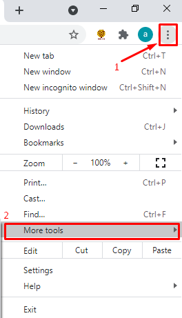
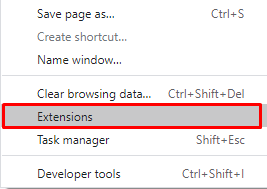
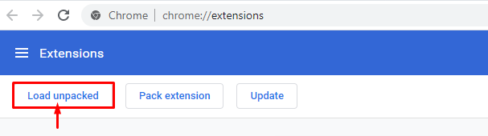

# **Ad Blocker Project**

This code is for Google Chrome Extension.

You can download all files under ***__src__*** folder. Then you can load the extension by following below steps: 
***__Chrome -> Extensions -> Manage Extensions -> Load Unpacked__***:

## Step 1 & 2:
Click on the **setup** at your Chrome Browser and go to **"More tools"**:

&emsp;&emsp;&emsp;&emsp;

## Step 3:
Select **"Extensions"** from the menu:

&emsp;&emsp;&emsp;&emsp;

Alternatively you can copy/paste _"chrome://extensions/"_ to your browser and hit _Enter_.

 ## Step 4:
Go with **"Load unpacked"** option and select your **src** folder:

&emsp;&emsp;

 ## Adding new domains
If you would like to add more domains, you can edit blocked_domains.js script file and include your new domain.
It is totally up to you to modify or reuse the code.

_**The extension is available at chrome if you would like to use it directly:**_
https://chrome.google.com/webstore/detail/no-more-ads/eccimakjijahpmhjnfbhbghkpdaohcic?hl=en
